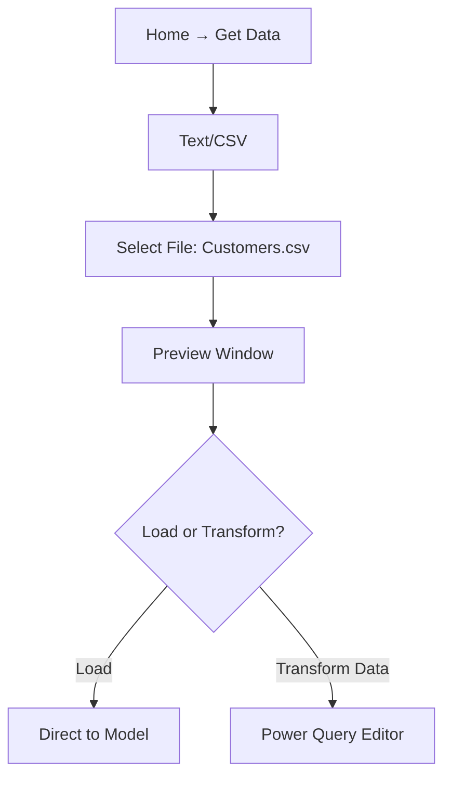

**Date**: 2025-11-03 14:47  
**Status**: Child  
**Tag**: [[Power BI]] [[Power Query]] [[data modeling]] [[Data Analysis]]

## 🎯 Overview & Objectives
This session builds on the **Power BI lifecycle** introduced last week. We dive deep into **Power Query** — the ETL (Extract, Transform, Load) engine of Power BI.

**Goals**:
- Understand data connection from multiple sources.
- Master **Power Query Editor** for cleaning and reshaping.
- Learn GUI-based transformations (no coding required).
- Prepare data for modeling and visualization.

> **Target Audience**: Beginners to intermediate analysts using Power BI Desktop.

---

## 🔄 Full Power BI Lifecycle (Expanded)

After connecting data from multiple datasets (e.g., CSV files for customers, products, and sales from 2019-2021), we often find the data isn't ready-made. For instance:
- Sales by region might require mapping continents.
- Fact tables may lack profit calculations or transaction details.
- We create dimension tables for breakdowns like region, country, quarter, specific days (e.g., evenings or afternoons), or time periods.

Transformations happen in Power Query, followed by data modeling and DAX calculations.

| Stage                      | Tools Used               | Key Activities                           | Example                                                                     |
| -------------------------- | ------------------------ | ---------------------------------------- | --------------------------------------------------------------------------- |
| 1. **Data Connection**     | Get Data                 | Import from Excel, CSV, SQL, Web, etc.   | Connect 3 CSV + 2 SQL tables (e.g., Customers.csv, Sales_2019-2021.csv)     |
| 2. **Data Transformation** | Power Query Editor       | Clean, merge, split, calculate           | Fix case, remove duplicates; create dimension tables (e.g., quarter, region-continent) |
|                            | Power Query, Excel etc.  | Create dimension tables                  | Region, country, specific date/time (e.g., evening/afternoon)               |
| 3. **Data Modeling**       | Model View               | Relationships, helper tables, dimensions | Link Sales → Customers                                                      |
| 4. **DAX Calculations**    | DAX Formula Bar          | Measures & calculated columns            | `Total Sales = SUM(Sales[Amount])`                                          |
| 5. **Visualization**       | Report View              | Charts, tables, dashboards               | Sales by Continent map                                                      |
| 6. **Publishing**          | Power BI Service         | Share online, schedule refresh           | Embed in website                                                            |

> **Real-World Example**:  
> Sales report using:
> - `Sales_2021.csv` (transactions)
> - `Customers.csv` (demographics)
> - `Calendar.csv` (dates)
> - `Products.csv` (product details)
> → Combined into **one interactive dashboard**  
> → We will do this by using different dimension tables (e.g., region-continent mapping).

---

## 🛠️ Setting Up Power BI Desktop

### 📥 Download & Install
1. Go to [powerbi.microsoft.com](https://powerbi.microsoft.com)
2. Download **Power BI Desktop** (Free)
3. Run installer → **Next → Next → Finish**

> **System Requirements**:
> - Windows 10+
> - 8 GB RAM recommended
> - 64-bit OS

### 🚀 Launch & Create Blank Report
1. Open **Power BI Desktop**
2. Click **"Blank Report"**
3. Interface loads:
   - **Report View** (default)
   - Switch via left sidebar: Report ↔ Data ↔ Model

---

## 📂 Data Connection Deep Dive

### Supported Data Import Sources (Partial List)

| Category          | Examples                                      |
|-------------------|-----------------------------------------------|
| **File**          | Excel (.xlsx), CSV/Text, JSON, XML            |
| **Database**      | SQL Server, Oracle, MySQL, PostgreSQL         |
| **Online**        | Web, SharePoint, Google Analytics             |
| **Power Platform**| Dataverse, Dataflows                          |
| **Other**         | Folder (combine multiple files), PDF          |

> **Why CSV?**  
> - Lightweight (1 MB vs 10 MB Excel) — Excel files include formatting, colors, filters, making them bloated and slower.  
> - No formatting bloat.  
> - Default export from ERPs (SAP, Oracle).  
> - When saving from Excel: Choose "CSV (Comma delimited)" for 1/10th the size; avoids full Excel configuration.  
> - **Import Tip**: File > Get Data > Text/CSV (or other types like Database, Fabric, Power Platform). Connect directly in Power BI or within Power Query for auto-loading.

### Step-by-Step: Connect CSV


#### Preview Window Options
| Button                   | Behavior                           |
| ------------------------ | ---------------------------------- |
| **Load**                 | Imports raw data (skips cleaning); goes to DAX/Data Modeling in Power BI |
| **Transform Data**       | Opens **Power Query Editor** ✅     |
| **Cancel**               | Abort connection                   |

> **Multiple Files Example**: Start with `Customers.csv`, then add `Sales_2019-2021.csv` and `Products.csv` via **New Source** in Power Query.

---

## 🧹 Power Query Editor: Full Interface Breakdown
![[Power Query Interface Breakdown.png]]
```plaintext
┌─────────────────────────────────────────────────────────────┐
│ Queries Pane     | Data Preview Grid     | Properties     │
│ - Customers      | [Table View]          | Query Name     │
│ - Sales          |                       | Applied Steps  │
└─────────────────────────────────────────────────────────────┘
          ↑
      Formula Bar (M Code)
```

| Element           | Function                                 | Tips                                       |
| ----------------- | ---------------------------------------- | ------------------------------------------ |
| **Queries Pane**  | List of tables                           | Right-click → Rename, Duplicate, Reference; also rename via Properties or left bar |
| **Data Preview**  | Live table view                          | Scroll, filter, sort                       |
| **Formula Bar**   | Shows auto-generated **M code**          | Toggle via **View → Formula Bar**          |
| **Applied Steps** | Transformation log                       | Click step to preview; Delete to undo      |
| **Ribbon**        | Home, Transform, Add Column, View, Tools | Context-sensitive; key tabs: Home (basic), Transform (text/date), Add Column (custom) |

### 🛠️ Applied Steps Example
```m
= Source                     → Connect to CSV
= Promoted Headers           → First row → columns (auto)
= Changed Type               → Detect data types (auto)
= Split Column by Delimiter  → Email → User + Domain
= Capitalized Each Word      → Mr. john → Mr. John
```

> **Undo in Power Query**: Delete step (not Ctrl+Z)

---

## ⚙️ Core Transformations (Home Tab)

### ➕ New Source
- Add another file mid-session
- Example: Start with `Customers.csv` → Add `Sales.csv`

### 📝 Enter Data (Virtual Table)
> **Use Case**: Map abbreviations, e.g., gender codes for analysis like "Which gender buys what product?" (Male/Female vs. M/F).  

| Code | Gender  |
|------|---------|
| M    | Male    |
| F    | Female  |

→ Name: `GenderMapping` → Load to model.

### 🔧 Data Source Settings
- Edit path: `D:\Data\Customers.csv` → `E:\Backup\`
- **Critical for shared projects**

### ⚡ Refresh Preview
- Simulates live data
- Only during development

### 🛠️ Query Properties
| Option                  | Use |
|-------------------------|-----|
| **Enable Load**         | Include in final model |
| **Include in Report Refresh** | Auto-update on open |

### 🕹️ Manage Table
- Duplicate table
- Reference: Creates a child table; changes in child reflect in parent — use with caution to avoid unintended updates.

> **Transform vs. Add Column**:  
> - **Transform** (e.g., in Transform tab): Modifies existing column in-place (saves memory).  
> - **Add Column**: Creates a new column (safer for testing; common for Format, Date/Time, Duration in Transform/Add Column tabs).

---

## 🗂️ Column & Row Operations

### ✂️ Split Column by Delimiter (Advanced)
```plaintext
Email: john.doe@company.com
Delimiter: @
→ Column1: john.doe
→ Column2: company.com
```

**Advanced Options**:
- **At each occurrence** (like Excel)
- **Leftmost / Rightmost**
- Multi-character: `" - "` or `" FOR "`

### 📏 Extract Text Functions

| Function        | Syntax Example              | Excel Equivalent           | Power Query Note |
| --------------- | --------------------------- | -------------------------- | ---------------- |
| **Length**      | `Text.Length([Occupation])` | `=LEN()`                   | Counts characters |
| **First Chars** | `Text.Start([Code], 3)`     | `=LEFT()`                  | From start |
| **Last Chars**  | `Text.End([Code], 4)`       | `=RIGHT()`                 | From end |
| **Range**       | `Text.Middle([Code], 3, 4)` | `=MID(text, start+1, len)` | 1-based index; start position not included in result (unlike Excel MID) |

> **Note**: Power Query is **1-based index**, but `Text.Middle` adjusts logically (subtle difference from Excel: start point excluded).

#### Practical Example: Product Code
Input text like transaction descriptions requires extraction for clean analysis.

| Original Text                          | Goal                  | Power Query Step                          | Result       |
|----------------------------------------|-----------------------|-------------------------------------------|--------------|
| ACLG2402516 FOR SITE A-1253 DTD 24.08.2025 | Extract Code         | Add Column → Text Before Delimiter → " FOR" | ACLG2402516 |
| ACLG2402516 FOR SITE A-1253 DTD 24.08.2025 | Extract Site ID      | Add Column → Text Between Delimiters → "SITE " & " DTD" | A-1253      |
| LG COMMISSIONS NO ACLG2402516 FOR SITE A-1253 DTD 24.08.2025 | Extract Code (Longer) | Add Column → Text After Delimiter → "NO " then Before " FOR" | ACLG2402516 |

> **Excel Alternatives** (for comparison; use FIND for dynamic positions):

| Original Text                          | Excel Formula (Code)          | Excel Formula (Site ID)              | Result (Code) | Result (Site ID) |
|----------------------------------------|-------------------------------|--------------------------------------|---------------|------------------|
| ACLG2402516 FOR SITE A-1253 DTD 24.08.2025 | `=LEFT(A2,11)` or `=MID(A2,1,11)` | `=MID(A2,FIND("SITE ",A2)+5,6)`     | ACLG2402516  | A-1253          |
| LG COMMISSIONS NO ACLG2402516 FOR SITE A-1253 DTD 24.08.2025 | `=MID(A2,FIND("NO ",A2)+3,11)` | `=MID(A2,FIND("SITE ",A2)+5,6)`     | ACLG2402516  | A-1253          |

Apply on `[Occupation]` column, e.g., "professional":  
- First Chars (3): "pro"  
- Last Chars (4): "onal"  
- Range (start 4, length 4): "essi" (start excluded).

---

## 🔡 Text Cleaning (Transform Tab)

| Operation | Before          | After            | Use Case      |
|-----------|-----------------|------------------|---------------|
| **Capitalize Each Word** | mr. john doe | Mr. John Doe    | Names        |
| **Uppercase** | sales rep      | SALES REP       | Codes        |
| **Lowercase** | ProFessioNal  | professional    | Consistency  |
| **Trim**  | "  hello   "   | "hello"         | Remove spaces|
| **Clean** | "HelloWorld"   | "HelloWorld"    | Non-printable chars |

> **Transform** = Modify in-place (saves memory)  
> **Add Column** = New column (safer for testing)

---

## 📅 Date & Time Mastery

### Extract from `BirthDate`
| Component   | Result | DAX/PQ Function                  |
|-------------|--------|----------------------------------|
| Year        | 1965   | `Date.Year([BirthDate])`         |
| Month       | 4      | `Date.Month([BirthDate])`        |
| Month Name  | April  | `Format([BirthDate], "MMMM")`    |
| Quarter     | Q2     | `Date.Quarter([BirthDate])`      |
| Day         | 8      | `Date.Day([BirthDate])`          |
| Day of Week | Monday | `Date.DayOfWeekName([BirthDate])`|

### 🕰️ Age Calculation (Dynamic)
```m
AgeInDays = Duration.Days(DateTime.LocalNow(), [BirthDate])
AgeInYears = AgeInDays / 365.25
```
→ Add Column → **Date → Age** (uses BirthDate vs. system date, e.g., Nov 3, 2025)  
→ Convert → **Duration → Total Years**  
→ Round: **From Number → Rounding → Round** (e.g., to whole years)

| BirthDate  | System Date (Ex: Nov 3, 2025) | AgeInDays | AgeInYears (Rounded) |
|------------|-------------------------------|-----------|----------------------|
| 1980-05-15 | 2025-11-03                    | 16,520   | 45                   |
| 1995-12-01 | 2025-11-03                    | 10,945   | 30                   |

> **Real-Time**: Uses **Control Panel date**.  
> **Use Case**: Customer master analysis, e.g., age groups (Young/Middle/Senior) for segmentation.

---

## 🔢 Number Transformations

| Category    | Options                  |
|-------------|--------------------------|
| **Rounding**| Round, Up, Down          |
| **Scientific** | 1.23E+10             |
| **Statistics** | Sum, Avg, Min, Max (on selection) |
| **Trigonometry** | Sin, Cos, etc.     |

#### Custom Calculation Example
```m
Bonus = [Salary] * 0.1
```
→ Add Column → Custom Column → Formula

---

## 🧩 Advanced: Index & Conditional Columns (Preview)

### 🔢 Index Column
- **From 0** or **From 1**
- Reorder: Right-click → Move → To Beginning

### ❓ Conditional Column (Next Class)
```m
Age Group = 
if [Age] < 30 then "Young"
else if [Age] < 50 then "Middle"
else "Senior"
```

---

## ⚠️ Performance & Best Practices

| Do                          | Don't                          |
|-----------------------------|--------------------------------|
| Use **Transform** over **Add Column** | Create 10+ duplicate columns  |
| Delete unnecessary steps    | Keep raw import columns        |
| Rename everything           | Rely on `Column1`, `Column2`   |
| Test with 100 rows first    | Transform full 1M rows         |

> **Golden Rule**:  
> **Fewer steps = Faster refresh = Happier users**

---

## 📈 Next Session: Power Query Level 2

| Topic              | Details                          |
|--------------------|----------------------------------|
| **Merge Queries**  | VLOOKUP on steroids              |
| **Append Queries** | Stack tables (union)             |
| **Folder Connection** | Auto-combine 100+ files      |
| **Conditional Logic** | If-then-else columns          |
| **Error Handling** | Replace, remove, fill            |

---

## ❓ Q&A Expanded

**Q: Power Query vs Excel Data Cleaning?**  
| Feature              | Excel | Power Query |
|----------------------|-------|-------------|
| Split by multi-char  | ❌    | ✅          |
| Auto M-code          | ❌    | ✅          |
| Reusable steps       | ❌    | ✅          |
| Handle 1M+ rows      | Slow  | Fast       |

**Q: Merge like VLOOKUP?**  
→ Yes! `Merge Queries` = Left Join  
→ Covered in **Data Modeling**

---

## 🎯 Final Summary

| Concept    | Key Command       | Purpose                  |
|------------|-------------------|--------------------------|
| Connect    | Get Data          | Import raw               |
| Clean      | Trim, Clean       | Fix text                 |
| Split      | By Delimiter      | Break columns            |
| Extract    | Text.Range        | Substrings               |
| Calculate  | Custom Column     | Math logic               |
| Age        | Duration.Days     | Dynamic dates            |

> **Practice Files**:  
> `Customers.csv`, `Sales_*.csv`, `Calendar.csv`  
> → Apply: Split email, capitalize names, calculate age

---

*Detailed notes from live training. Practice in Power BI Desktop for mastery.*  
*Date: November 3, 2025*